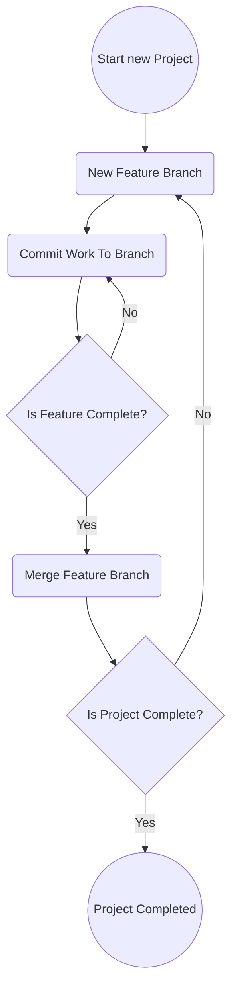

## Centralized
My workflow at its core, will be centralized, even though Git is a distributed version control system. This simply means that I'll have one central remote repository. Usually, After the first developer pushes his code onto the remote, subsequent pushes need to merge their own work with what has already been developed. Since I'm working alone, often on the same device, I'll rarely have to deal with these sorts of merging conflicts. Keep in mind that Git still isn't a centralized version control system, I'm still able to make a lot of local changes (commits, branching, etc) before pushing to the remote.
## Feature Branch Workflow
As i mentioned briefly in [Distributed-Version-Control-101.md](https://github.com/sdraken/Distributed-Version-Control-101/blob/main/Distributed-Version-Control-101.md) I'll be using the feature branch workflow as an outline. Implementation of every new feature takes place on its own dedicated branch, and is only merged into the main branch once completed. This enables the main branch to never (hopefully) contain any broken code, so it can act as a stable version of the project. It also makes it easier for multiple developers to work on independent features without stepping on each other's toes. Since I'm working alone, I could probably get away with only having one main branch for most of my projects. My reason for adhering to a workflow focused on collaborative work, is because I want to more closely resemble how Git is used in practice. 

A feature can often be split up into smaller features. If I want to implement basic arithmetic into my application, then I could either see "basic arithmetic operations" as one feature, or split it into 4 smaller features (one for each arithmetic operations, `+`, `-`, `*`, `/` ).  I'll generally try to keep feature branches short-lived but each branch should always represent an entire feature. 

If a feature is too easy to implement then it's probably better to see if some of its related features can be turned into a single feature branch. Whether a feature is easy to implement can depend on a lot of things. If I was Implementing arithmetic operations close to hardware level, then I'd probably split each operation into its own feature branch. However if i was working at a higher level of abstraction, then each operation would be too easy to implement. In this case I'd implement the 4 basic arithmetic operations in a single feature branch. 

## Visualizing Workflow
My workflow can be easily understood with this flow graph

## References
"What is a Git workflow?". about.gitlab.com. Accessed: Sep. 6, 2024. Available: https://about.gitlab.com/topics/version-control/what-is-git-workflow/

"Comparing Git workflows: What you should know". atlassian.com. Accessed: Sep. 6, 2024. Available: https://www.atlassian.com/git/tutorials/comparing-workflows

